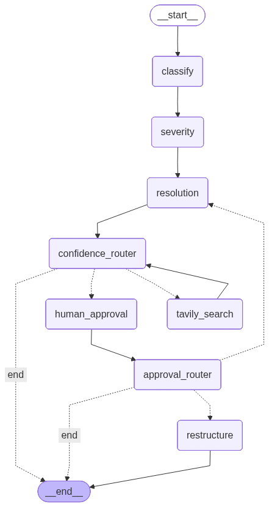

# 📡 AI-Based Telecom Incident Ticket Analyzer

An advanced, stateful multi-agent AI system powered by **LangGraph** and **Gemini 2.5 Flash** to ingest, classify, prioritize, and suggest resolutions for telecom incident tickets. The system features localized RAG (Retrieval-Augmented Generation) troubleshooting guides and real-time **Human-in-the-Loop** supervision.

---

## 🏗️ Architecture & Orchestration

The system orchestrates specialized agents in a stateful, cyclic workflow built on **LangGraph**. Below is the decision and control flow of the ticket processing pipeline:

```text
┌─────────────────────────────────────────────────────────────────┐
│                      INCOMING TICKET (CSV)                      │
└───────────────────────────────┬─────────────────────────────────┘
                                │
                                ▼
┌─────────────────────────────────────────────────────────────────┐
│             [AGENT 1] TICKET CLASSIFICATION                     │
│  - Extracts category: Network/Service/Hardware/Customer         │
└───────────────────────────────┬─────────────────────────────────┘
                                │
                                ▼
┌─────────────────────────────────────────────────────────────────┐
│             [AGENT 2] SEVERITY & TELEMETRY                      │
│  - Checks regional outage logs & database telemetry             │
│  - Formulates priority score (P1-P4) and impact (0.0-1.0)       │
└───────────────────────────────┬─────────────────────────────────┘
                                │
                                ▼
┌─────────────────────────────────────────────────────────────────┐
│             [AGENT 3] RAG RESOLUTION SUGGESTION                 │
│  - Similarity search in local ChromaDB (SentenceTransformer)     │
│  - Generates diagnostic steps & resolution confidence score     │
└───────────────────────────────┬─────────────────────────────────┘
                                │
                                ▼
┌─────────────────────────────────────────────────────────────────┐
│                     DECISION FLOW & ROUTER                      │
│                                                                 │
│  [Path A: Low Confidence (<0.65) & Loop < 2]                    │
│    └─► [AGENT 4] TAVILY WEB SEARCH ──► Recheck Confidence ──────┐│
│                                                                ││
│  [Path B: High Confidence (>=0.65) & Priority P3/P4]           ││
│    └─► Auto-approved ───────────────────────────────────┐      ││
│                                                         │      ││
│  [Path C: High Confidence (>=0.65) & Priority P1/P2]    │      ││
│    └─► [AGENT 5] HUMAN-IN-THE-LOOP APPROVAL             │      ││
│          ├─► Approved (No changes) ─────────────────────┼───┐  ││
│          ├─► Approved (With comments) ──► [AGENT 6]     │   │  ││
│          │                                RESTRUCTURE ──┼───┼──┘│
│          └─► Rejected ──► (Loop back to Agent 3 with    │   │   │
│                            human feedback concerns)     │   │   │
└─────────────────────────────────────────────────────────┼───┼───┘
                                                          │   │
                                                          ▼   ▼
┌─────────────────────────────────────────────────────────────────┐
│                 OUTPUT: Complete Analyzed Plan                  │
│  • Classification + Outage Telemetry + Severity + Approved Plan │
│  • Full terminal-interactive diagnostic execution log          │
└─────────────────────────────────────────────────────────────────┘
```

### Visualizing the Workflow
*   **Workflow Diagram**: A pre-rendered workflow diagram generated directly from the compiled LangGraph architecture:

    

*   **Re-generating the Diagram**: You can re-generate this diagram anytime by running:
    ```bash
    python generate_diagram.py
    ```
    This compiles the graph and saves the layout to `workflow_diagram2.png`.

---

## 🛠️ First-Time Setup & Installation

Follow these step-by-step instructions to install, configure, and initialize the system.

### 1. Prerequisites
Ensure you have **Python 3.10 to 3.13** and `pip` installed.

### 2. Install Dependencies
Install the required packages in your local Python environment:
```bash
pip install -r requirements.txt
```

### 3. Configure Environment Variables
Create a file named `.env` in the project root directory. Use the template below and configure it with your API credentials:
```env
# Gemini API Credentials (supports multiple keys for rate-limit decoupling)
GEMINI_API_KEY1=your_gemini_api_key_here
GEMINI_API_KEY2=your_gemini_api_key_here

# Tavily Web Search API (used as a fallback for low-confidence tickets)
TAVILY_API_KEY=your_tavily_api_key_here

# LangSmith / LangChain Tracing (Optional - set to 'true' to log graph traces)
LANGSMITH_TRACING=true
LANGSMITH_ENDPOINT=https://api.smith.langchain.com
LANGSMITH_API_KEY=your_langsmith_api_key_here
LANGSMITH_PROJECT="Telecom"
```

### 4. Ingest Troubleshooting Documents (RAG Database)
The system retrieves domain-specific troubleshooting steps from four PDF guides. Initialize your local Chroma database by running:
```bash
python ingest_knowledge_base.py
```
**What this script does:**
1. Detects and loads the 4 PDF guides in the project root:
   *   `PDF1_Network_Connectivity_Guide 2.pdf`
   *   `PDF2_Service_Outage_Guide 2.pdf`
   *   `PDF3_Hardware_Equipment_Guide 2.pdf`
   *   `PDF4_Customer_Experience_Guide 2.pdf`
2. Performs a clean reset of old Chroma folders to guarantee compatibility.
3. Extracts and chunks document text with safety overlaps.
4. Generates vector embeddings using the local `SentenceTransformer('all-MiniLM-L6-v2')` model.
5. Saves chunks into a local persistent ChromaDB collection named `customer_support_guide`.
6. Executes a quick query check to ensure vector search works perfectly.

---

## 🚀 Running the Incident Analyzer

The primary entry point to execute the LangGraph-based workflow is `main.py` through the command-line interface.

### 1. Run a Demo Single Ticket
To test the pipeline on a realistic, default sample ticket:
```bash
python main.py
# or
python main.py single
```
The program will parse a sample CSV ticket, run the multi-agent orchestration, print agent logs, check outage telemetry, and output the finalized resolution plan to the console.

### 2. Run a Custom Ticket
You can run the analyzer on any custom incident by passing a CSV-formatted ticket row directly:
```bash
python main.py single "TKT9999,2024-05-24 10:00:00,CUST1122,Mumbai,Dropped calls in south region,Consistent call drops when connecting to cell site cell_id 412,Mobile Data,Web,Open"
```
Alternatively, write the CSV ticket into a file and pass the filepath:
```bash
python main.py single path/to/ticket.csv
```

> 📌 **Expected CSV Schema Format:**
> `ticket_id,created_at,customer_id,region,subject,description,affected_service,channel,status`

---

## 🤝 Human-in-the-Loop Interaction

For high-priority incident tickets (**P1** and **P2**), the system automatically pauses and prompts for interactive human supervision directly in your terminal.

1. **Review Dashboard**: The CLI prints a detailed card displaying the raw incident, identified classification category, assigned priority score, telemetry outage overlap (if any), hypothesized root cause, and suggested steps.
2. **Interactive Decision**:
   ```text
   Do you approve this resolution? (yes/no): 
   ```
3. **Execution Routing Paths**:
   *   **Approved (`yes`) with NO modifications**: The workflow completes immediately and outputs the resolution.
   *   **Approved (`yes`) WITH modifications**: Enter requested changes. The **Restructuring Agent** will intercept, seamlessly integrate your comments, and rewrite the final plan.
   *   **Rejected (`no`)**: Enter the reasons or concerns. The workflow loops back to the **Resolution Suggestion Agent**, passing your concerns as direct feedback so the LLM reformulates a completely new plan.

---

## 🤖 Detailed Agent Roles & Pipelines

| Agent | Purpose & Capability | Tool / RAG Resource |
| :--- | :--- | :--- |
| **Ticket Classification** | Categorizes ticket into one of four core domains: `Network_connectivity`, `Service_outage`, `Hardware_equipment`, or `Customer_experience`. | Structured output via Gemini 2.5 Flash |
| **Severity & Telemetry Detection** | Assigns priority level (P1 to P4) and impact score (0.0 to 1.0). Detects overlapping outages in the region. | Searches regional logs in `data/synthetic/network-outage-incident-logs.json` |
| **RAG-Enhanced Resolution** | Pulls related documentation from troubleshooting guides and formulates a step-by-step resolution. | Vector similarity search in ChromaDB using local SentenceTransformer |
| **Tavily Web Search** | Triggers if confidence score is low (< 0.65). Formulates search queries and structures web-based fixes. | Web search integration via Tavily API |
| **Human-in-the-Loop Approval** | Gates critical P1/P2 tickets to ensure safety, allowing managers to approve, reject, or request changes. | Terminal-based interactive routing |
| **Restructuring Agent** | Automatically refines and rewrites the step-by-step resolution plan based on feedback. | Instruction alignment via Gemini 2.5 Flash |

---

## 📂 Project Structure

```
├── config.py                 # Central configurations, API keys, path management
├── main.py                   # CLI Entry Point (LangGraph Runner, CSV Parser, demo sample)
├── agents.py                 # Specialized Agent Classes (Classification, Severity, RAG, Search, Restructuring)
├── workflow.py               # Stateful LangGraph Orchestrator & conditional routers
├── ingest_knowledge_base.py  # PDF text extraction, SentenceTransformers embedding, ChromaDB ingestion
├── generate_diagram.py       # Helper script to re-generate the compiled LangGraph diagram
├── requirements.txt          # Python package requirements
├── .env                      # Local environment configuration file
├── workflow_diagram1.png     # Rendered LangGraph workflow diagram
├── PDF1_Network_Connectivity_Guide 2.pdf
├── PDF2_Service_Outage_Guide 2.pdf
├── PDF3_Hardware_Equipment_Guide 2.pdf
├── PDF4_Customer_Experience_Guide 2.pdf
└── data/
    ├── synthetic/            # Offline ticket database & incident telemetry logs
    │   ├── telecom_tickets_india.csv
    │   └── network-outage-incident-logs.json
    └── chroma_db/            # Local Chroma Vector Database (generated during ingestion)
```

